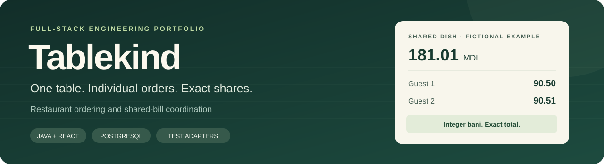
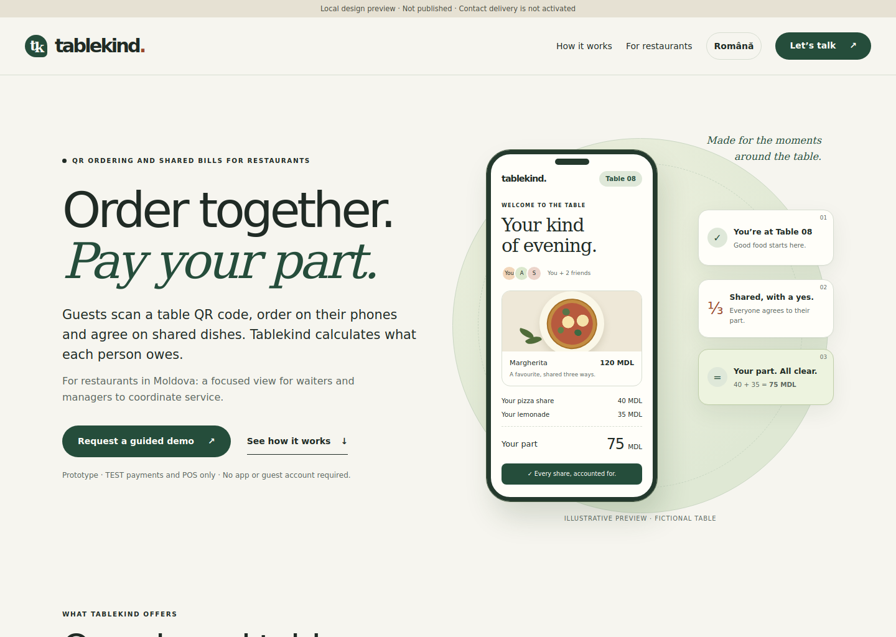
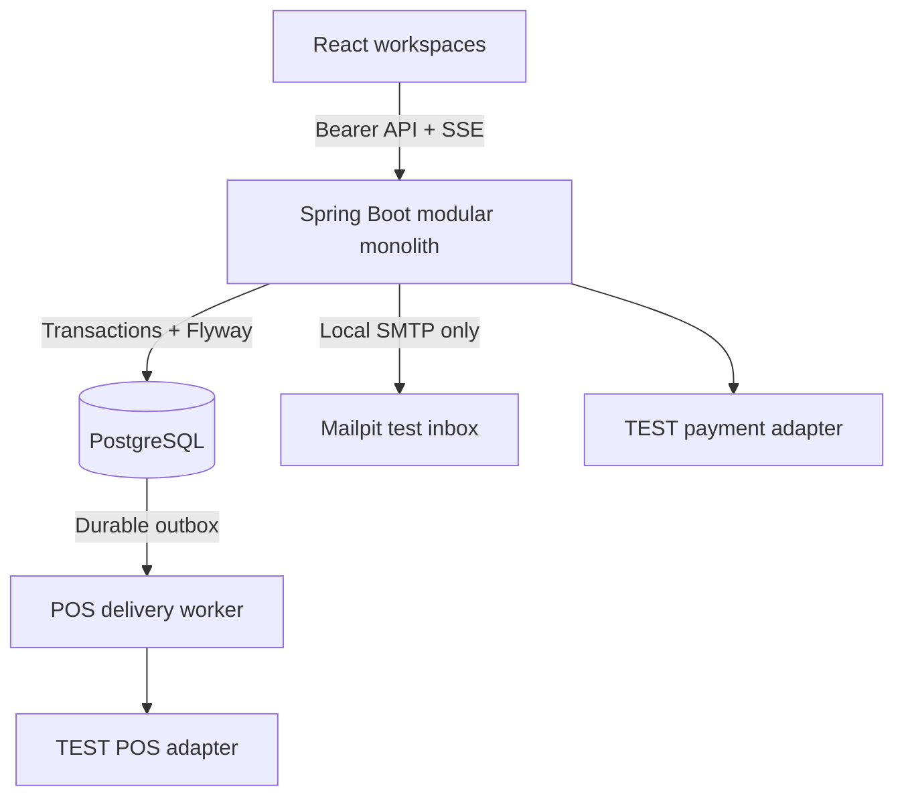

<div align="center">



**A full-stack restaurant ordering and shared-bill prototype.**

Java 21 · Spring Boot 3.5 · PostgreSQL 16 · React 19 · TypeScript · Docker

[Features](#what-it-does) · [Quick start](#quick-start) · [Architecture](#architecture) · [Tests](#testing-and-evidence) · [Documentation](#documentation)

</div>

Tablekind models a group meal from scanning a table QR code to settling each guest's share. Guests can order individually, agree to share an item, cover someone else's portion, and leave after their own balance is settled. Restaurant staff and managers work in separate interfaces.

Built around a Moldova use case, the application uses **integer bani** for MDL amounts and supports translated menu content. It is maintained here as an engineering portfolio project.

> **Status:** runnable local prototype. Payments and POS connections are **TEST simulators**. Tablekind does not collect card details, move real money, send orders to a real kitchen, issue fiscal receipts, or confirm real reservations. The presentation website is separate from the operational application.

## At a glance

| Component | Version | Purpose |
| --- | --- | --- |
| Restaurant application | **0.10.2** | Guest, waiter, manager and platform administrator workflows |
| Presentation website | **0.11.3** | English/Romanian explanation and interactive fictional example |
| Database | **Flyway V1–V9** | Restaurant isolation, orders, accounting, identity and practice workflows |

### Engineering highlights

- **Exact accounting:** deterministic rounding, an append-only ledger, immutable accepted prices and separate bill/tip amounts.
- **Safe retries:** command fingerprints, idempotency keys, session revisions and recovery after a lost HTTP response.
- **Durable delivery:** a transactional POS outbox with ordered delivery, backoff, lease fencing and reconciliation.
- **Server-side access control:** separate identities, restaurant-scoped memberships and authorization before cached command replay.
- **Operational recovery:** readiness/liveness probes, isolated outage exercises, PostgreSQL backups and restore comparisons.
- **Usable interfaces:** mobile layouts, keyboard/accessibility checks, optional guest accounts, live updates and a guided private demo.

## What it does

| Guest | Restaurant team |
| --- | --- |
| Scan or paste a table link and join with a nickname | Set up restaurants, branches, tables, menus and staff |
| Order without creating an account | Review orders and update preparation/service state |
| Agree to shared items and inspect an individual balance | Print reusable QR cards and control table sessions |
| Take over eligible unpaid portions or cover another guest | Confirm fictional cash/terminal payments and perform TEST refunds |
| Coordinate partial and mixed TEST payments | Inspect TEST POS delivery, bill comparisons and operational alerts |
| Optionally save preferences and link visits to an account | Review anonymous aggregate pilot counters |

**Example:** two guests share a dish costing **181.01 MDL**. Their allocations become **90.50 MDL** and **90.51 MDL**, preserving the exact total. A confirmed TEST payment settles only its reserved portions. The other guest's outstanding share remains visible.

The allocation rule is deterministic. The original orderer, recipient, person responsible for a share and person paying can be different people.

### Four workspaces

| Workspace | Route | Access boundary |
| --- | --- | --- |
| Guest | `/guest` | Anonymous table joining. Optional accounts at `/guest/account` |
| Waiter | `/staff` | Restaurant membership and service actions |
| Manager / owner | `/manage` | Restaurant configuration, staff, reconciliation and operations. Ownership controls require OWNER |
| Platform administrator | `/admin` | Separately provisioned identity with mandatory MFA. No public administrator registration |

Platform authority does not automatically grant restaurant access. Customer accounts cannot directly act as table guests. Linking a visit requires both identities to be verified by the application.

<details>
<summary><strong>Presentation website preview</strong></summary>



Captured from the actual local 0.11.3 presentation site with fictional content. This is the separate presentation page, not a live restaurant deployment.

</details>

## Quick start

### 1. Run the application

Install **Git** and **Docker Desktop with Linux containers**, then open PowerShell:

```powershell
git clone https://github.com/Kazumi565/tablekind-portfolio.git
Set-Location tablekind-portfolio
docker compose up -d --build --wait
```

The first build downloads images and dependencies. Flyway applies the schema. A completely empty database receives a fictional restaurant, five tables and a sample menu.

| Service | Local address |
| --- | --- |
| Restaurant app | http://localhost:5173/manage |
| Captured TEST email | http://localhost:8025 |
| API documentation | http://localhost:8080/swagger-ui.html |
| Readiness | http://localhost:8080/actuator/health/readiness |

**Fresh local database login**

```text
Email:    manager@tablekind.test
Password: Local-Review-2026!
```

These are intentionally public development fixtures. Local ports bind to loopback. Use this configuration only for fictional data on your own computer. The separate private demo generates its own credentials.

Existing databases retain their accounts. Bootstrap settings do not rename a user or reset a password. An older installation may therefore use a different login.

### 2. Explore a table

1. Sign in at `/manage`, select the seeded restaurant and open a table session.
2. Generate its link/QR. Open the guest link in a separate browser tab and join with a nickname.
3. Join a second guest in another fresh tab. Accounts are optional.
4. Submit guest orders and accept them through the staff workspace.
5. Propose sharing an item, accept it as the other guest, and inspect both balances.
6. Try a TEST card outcome and a staff-confirmed fictional cash payment. Check the remaining amounts and change.
7. Explore **POS integration** and **System status** from management.

Camera scanning requires a secure context and a browser with native `BarcodeDetector` support. Paste-link and the phone's own QR camera are alternatives. The scanner previews the table and moves to the join form. Nickname confirmation and server authorization still apply.

Stop while retaining the database:

```powershell
docker compose down
```

`down --volumes` deletes the stack's data and is not part of the normal stop procedure.

### 3. Preview the presentation website

With **Node.js 22.12+**, from the repository root:

```powershell
npm.cmd --prefix website run build
npm.cmd --prefix website run preview
```

Open http://127.0.0.1:5190/ or http://127.0.0.1:5190/ro/. Build and preview use Node built-ins and do not require `npm ci`. Keep the terminal open. Ctrl+C stops the preview.

The site includes an interactive bill example, responsive layouts, reduced-motion behavior and a local enquiry-draft composer. It does not send email or connect to the restaurant API. Domain and contact configuration are intentionally blank.

### 4. Optional guided private demo

The standalone demo uses a separate Compose project, database and generated credentials:

```powershell
powershell.exe -NoProfile -ExecutionPolicy Bypass -File .\scripts\demo\Start-Demo.ps1
powershell.exe -NoProfile -ExecutionPolicy Bypass -File .\scripts\demo\Show-DemoLogin.ps1
```

Open http://localhost:5180 and follow **Start practice table**. The eleven-step guide covers two guests, waiter/manager controls, sharing consent, TEST payment/POS reconciliation, local verification email and a fictional reservation.

[Private demo setup](docs/PRIVATE_DEMO.md) covers optional Tailscale HTTPS access. It requires the viewer's Tailscale connection and explicit access. There is no publicly hosted live demo. Keep the generated credentials and `.env.demo` private.

## Architecture



The static `website/` is built and served separately. It has no connection to the application API or database.

### Why these choices

| Decision | Reason and implementation |
| --- | --- |
| Modular monolith | One deployable backend keeps transactions explicit, with identity, ordering, billing, payments, POS and operations organized into packages |
| PostgreSQL authority | Composite foreign keys, row/advisory locks and constraints support tenant boundaries and financial invariants |
| Integer money | `Money` and `Allocations` distribute bani without floating-point drift. Stable tie-breaking makes repeated calculations agree |
| JPA plus parameterized JDBC | JPA manages the restaurant registry. JDBC expresses ledger/concurrency operations within the shared transaction manager |
| Idempotent commands | A UUID key and request fingerprint identify a mutation. Identical retries return the saved result. Changed input under the same key conflicts |
| Durable integration boundary | The POS outbox commits with the business change. Delivery runs outside the business transaction and retries the same message identity |
| Explicit uncertain outcomes | A missing response does not mean failure. Payment holds stay protected until authoritative TEST-provider lookup resolves the original attempt |

### Code worth reading

- [Command handling and saved responses](backend/src/main/java/md/tablekind/common/Commands.java)
- [Allocation and rounding](backend/src/main/java/md/tablekind/billing/Allocations.java)
- [Payment lifecycle and settlement](backend/src/main/java/md/tablekind/payments/Payments.java)
- [POS delivery and lease handling](backend/src/main/java/md/tablekind/pos/PosDelivery.java)
- [Authorization before replay](backend/src/main/java/md/tablekind/auth/AuthorizationInterceptor.java)
- [Browser request recovery](frontend/src/pendingCommand.ts)
- [Isolated outage and restore exercise](scripts/ops/review.py)

## Repository map

| Path | Contents |
| --- | --- |
| `backend/` | Spring Boot application, Java tests and Flyway migrations |
| `frontend/` | React application, QR scanning, four workspaces and browser tests |
| `website/` | Separate English/Romanian presentation site and its tests |
| `scripts/demo/` | Windows private-demo lifecycle and access helpers |
| `scripts/ops/` | Monitoring, backup, restoration and disposable outage review |
| `scripts/security/` | Public-source checks and regression tests |
| `docs/` | Design contracts, operational guides and versioned validation |
| `.github/workflows/` | Automated checks for the portfolio repository |

## Testing and evidence

**Implemented, previously tested, and tested on the current checkout are different claims.** The versioned records below preserve that distinction.

| Evidence | Scope and result |
| --- | --- |
| [Native Windows acceptance, 0.9.1](docs/WINDOWS_ACCEPTANCE_0_9_1.md) | 151 backend tests passed, no failures/errors/skips. PostgreSQL migration, mobile/pilot and private-demo checks recorded |
| Same 0.9.1 operational run | 500 reads, 20 concurrent clients, zero unexpected errors, p95 390 ms. Isolated outage recovery and exact comparison of 48 restored tables passed |
| [QR release, 0.10.2](docs/PHASE10_VALIDATION.md) | Four parser cases passed in its recorded environment. Native camera and platform-specific acceptance are separate |
| [Presentation site, 0.11.3](docs/PHASE11_3_CLARITY_LANGUAGE.md) | Eight build tests and recorded English/Romanian browser, motion and accessibility checks |
| [Portfolio preparation](docs/PUBLIC_RELEASE_REVIEW.md) | Current source audit, checks actually rerun, changes and unverified boundaries |

The 0.9.1 workload is a small local correctness/recovery check, not a production capacity benchmark. Historical results do not certify a later checkout. Automated accessibility checks do not replace manual assistive-technology testing.

### Backend tests

With Docker running, from the root:

```powershell
docker compose --profile test run --build --rm tests
```

Tests use a separate disposable PostgreSQL service. Surefire reports appear in `test-results/backend/`. Never point `TEST_DB_URL` at an application database.

### Frontend and website checks

```powershell
npm.cmd --prefix frontend ci
npm.cmd --prefix frontend run build
npm.cmd --prefix frontend run test:recovery
npm.cmd --prefix frontend run test:qr-code

npm.cmd --prefix website ci
npm.cmd --prefix website test
npm.cmd --prefix website run build

py -3 scripts\ops\test_tools.py
py -3 scripts\security\test_review_source.py
```

<details>
<summary><strong>Browser tests and operational recovery</strong></summary>

Application browser tests need a running local fictional stack, Chromium and a valid test manager:

```powershell
Set-Location frontend
npm.cmd exec -- playwright install chromium
$env:TEST_APP_URL = 'http://localhost:5173'
$env:TEST_STAFF_EMAIL = Read-Host 'Local test manager email'
$password = Read-Host 'Local test manager password' -AsSecureString
$env:TEST_STAFF_PASSWORD = [System.Net.NetworkCredential]::new('', $password).Password
try {
    npm.cmd run test:accounts
    npm.cmd run test:email
    npm.cmd run test:browser
    npm.cmd run test:pos
    npm.cmd run test:phase7
    npm.cmd run test:operations
    npm.cmd run test:pilot
    npm.cmd run test:qr-camera
} finally {
    Remove-Item Env:TEST_APP_URL, Env:TEST_STAFF_EMAIL, Env:TEST_STAFF_PASSWORD
    Remove-Variable password
    Set-Location ..
}
```

Inspect each result. These scenarios create fictional data. An MFA-protected manager needs a dedicated local test account for unattended login.

Website browser checks create their own loopback server:

```powershell
Set-Location website
npm.cmd exec -- playwright install chromium
npm.cmd run test:browser
npm.cmd run test:motion
npm.cmd run test:experience
npm.cmd run test:bilingual
Set-Location ..
```

For the isolated native outage/restore exercise:

```powershell
py -3 scripts\ops\review.py
```

The review creates randomly named containers/databases and cleans up only its own resources. See [operations](docs/OPERATIONS.md) for the procedure and limitations.

</details>

## Local development

Use JDK 21 and open `backend/pom.xml` in your IDE. Start PostgreSQL and run the local profile:

```powershell
docker compose up -d postgres
$env:SPRING_PROFILES_ACTIVE = 'local'
$env:DB_URL = 'jdbc:postgresql://localhost:54329/tablekind'
$env:DB_USER = 'tablekind'
$env:DB_PASSWORD = 'tablekind-local'
Set-Location backend
.\mvnw.cmd spring-boot:run
```

In a second terminal, from `frontend/`, run `npm.cmd ci` and `npm.cmd run dev`. Stop the Compose backend/frontend first if they occupy ports 8080/5173. This IDE setup leaves email in its default OFF mode. Full Compose is the simplest way to exercise Mailpit.

## Security and boundaries

- BCrypt password hashing, versioned sign-ins, optional staff TOTP and mandatory platform-administrator TOTP.
- Tenant-qualified access and database relationships, with permissions checked before privileged command replay.
- Purpose-bound local email challenges, bounded retries and captured Mailpit delivery.
- No public administrator registration. The [local provisioning tool](scripts/admin/Create-PlatformAdmin.ps1) displays recovery material only to its operator.
- Profile-restricted TEST providers. Other profiles reject payment/refund mutations. Hardened configuration is a guard, not a completed production deployment.
- QR tokens, bearer credentials, database dumps, recovery codes and private demo settings belong outside Git.

See [SECURITY.md](SECURITY.md) for supported use and reporting. No penetration test, provider certification or production security certification is claimed.

## Current limitations

| Area | Boundary |
| --- | --- |
| Payments / POS / fiscal | Simulators only. No bank, MIA, physical terminal, production POS or fiscal integration |
| Reservations | Fictional request/approval exercise. No real capacity hold or confirmed booking |
| Email / SMS | Local Mailpit only. No production delivery provider or SMS workflow |
| Localization | Presentation site: English/Romanian. Menu content: English/Romanian/Russian. Operational UI controls: English |
| Hosting | Local/private operation. Domain, public deployment and ongoing service are not configured |
| Customer validation | No claim of paying restaurants, a live restaurant pilot or demonstrated business results |
| Operations | No sustained capacity qualification, managed offsite backup service or staffed incident response |

## Documentation

| Read next | Guide |
| --- | --- |
| Design and financial invariants | [Architecture](docs/ARCHITECTURE.md) |
| Attempts, refunds and provider boundary | [Payment contract](docs/PHASE5_PAYMENTS.md) |
| Outbox, connectors and reconciliation | [POS design](docs/PHASE6_INTEGRATIONS.md) |
| Roles, accounts and local verification | [Accounts](docs/PHASE8_ACCOUNTS.md) · [Email](docs/PHASE9_EMAIL.md) |
| Monitoring, backup, restoration and incidents | [Operations](docs/OPERATIONS.md) |
| Camera behavior and fallback | [QR scanning](docs/PHASE10_QR_SCANNER.md) |
| Presentation site | [Website README](website/README.md) |
| Public portfolio preparation | [Publication guide](docs/PUBLICATION.md) · [Review evidence](docs/PUBLIC_RELEASE_REVIEW.md) |
| Historical milestones | [Phase record](docs/PHASES.md) |

Phase handoffs and earlier acceptance records describe their named releases. Their old paths, pending gates and rollout plans are historical context. This README is the starting point for the portfolio source.

**License:** no open-source license has been selected for the project. Third-party components retain their own licenses.
